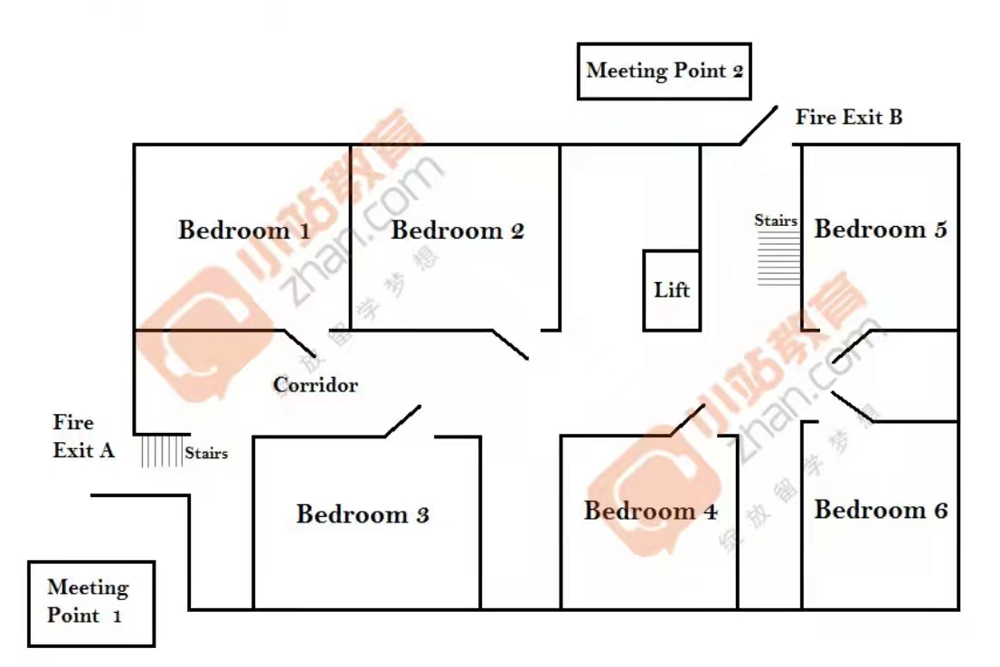
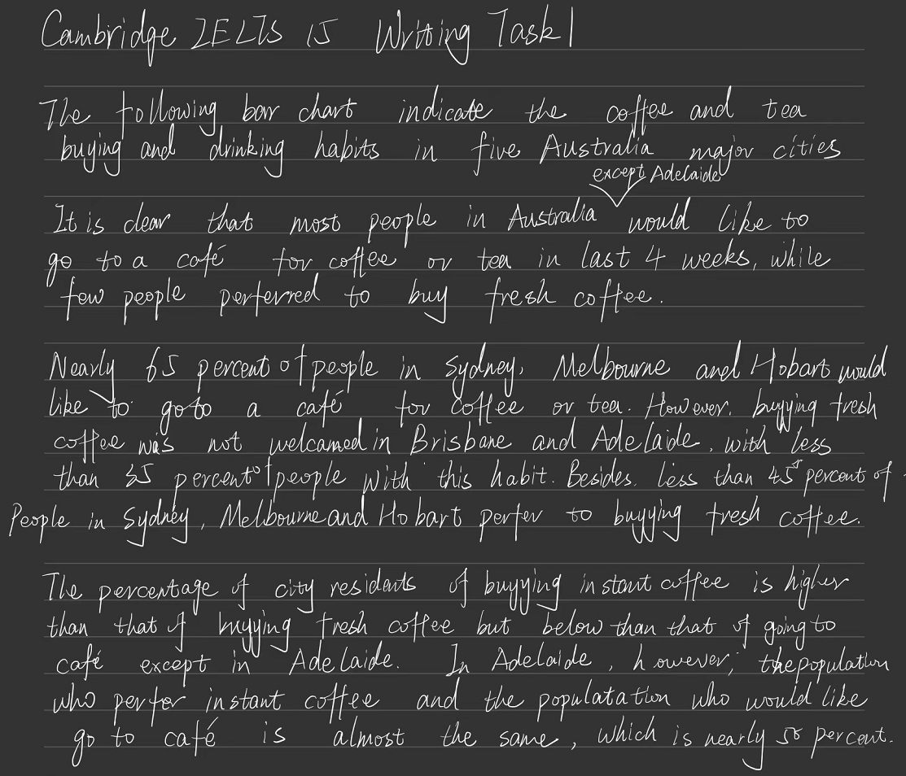
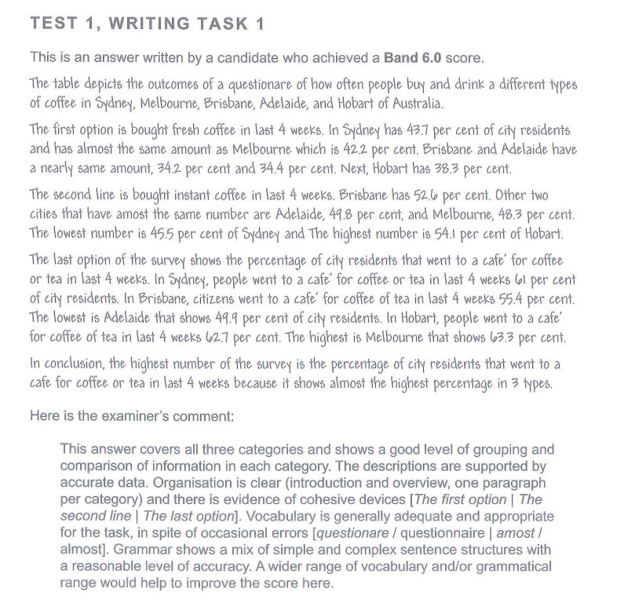
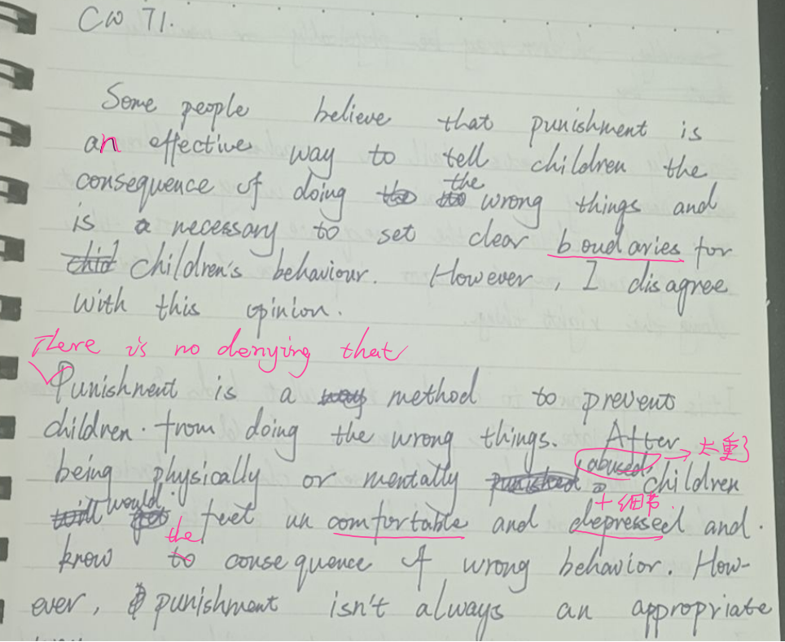
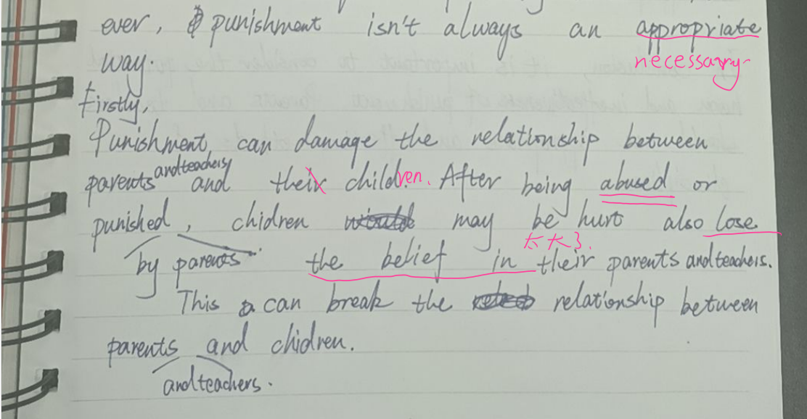
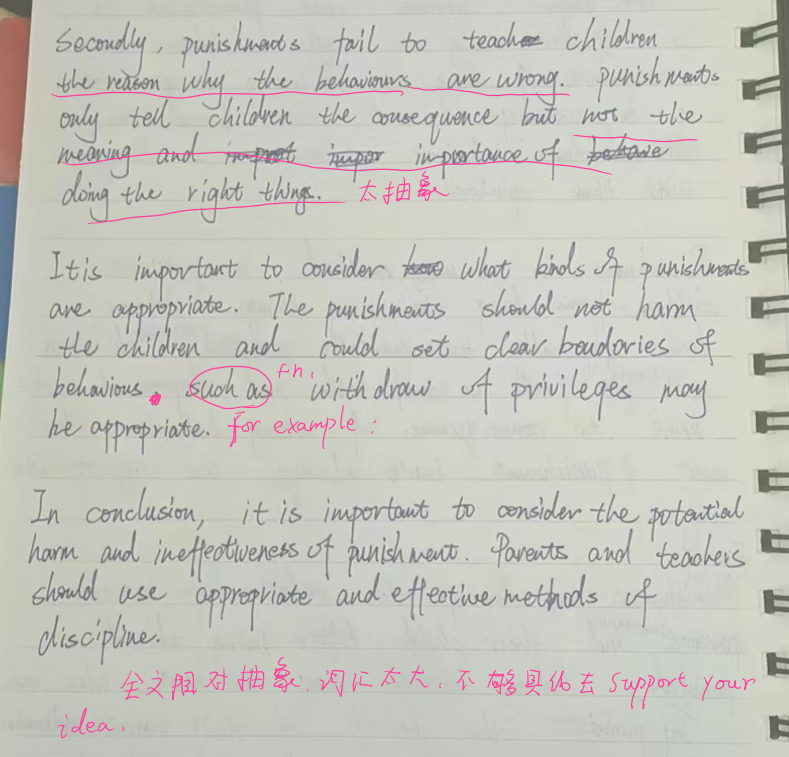
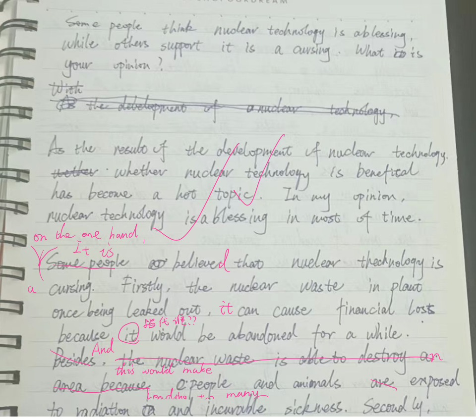
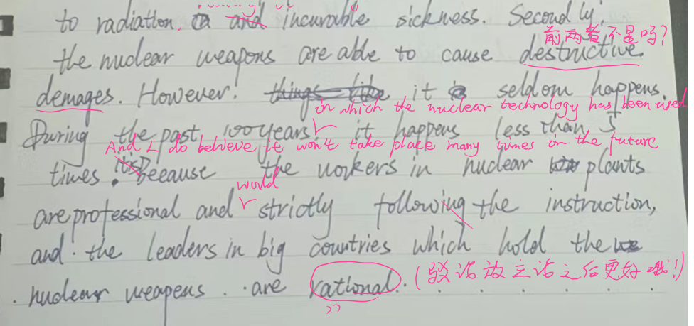
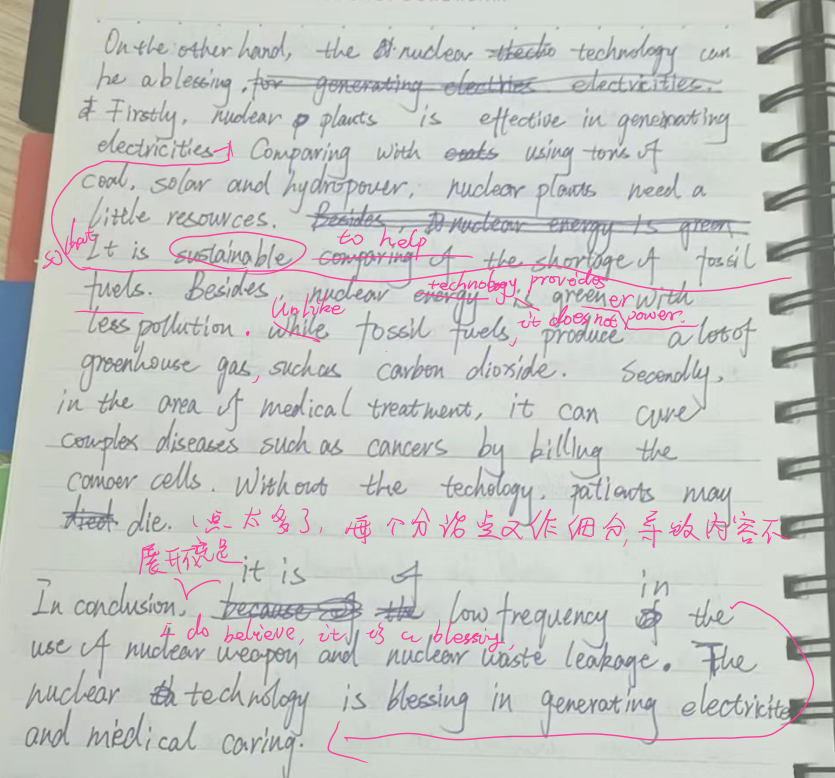

# 写作

## 小作文（需要清晰介绍图的内容和数据）

**some common phrases for describing directions in IELTS map questions are:**

* **Prepositions of place**, such as near, in front of, next to, beside, across from, between
* **Prepositions of direction**, such as turn right, turn left, go straight on, travel northwest, (run/walk/drive) back
* **Compass points**, such as north, south, east, west, northeast, northwest, southeast, southwest
* **Verbs of location and change**, such as build, construct, extend, expand
* **Positions and distances**, such as on the left-hand side, on the other side of, just beyond, 
* phrases to compare and contrast places, such as great changes are evident, there are both similarities and differences.

### 地图

* summary: 有几个出口，有几个房价
* （整体需要）介绍出口和房间的位置，以及逃生路线的数目
* Body 1: Fire Exit A，+逃生路线。Body 2: Fire Exit B, **Lift**

This is a map which introduces how to escape from emergency situation for students living in the second floor of the accommodation.

There are two fire exits in the second floor. The exit A is located on the west of the building, while the exit B is located on the northeast of the building. Students living in the six bedrooms in the second floor can escape through the two ways.

The Bedroom 1, Bedroom 2 and Bedroom 3 are nearby the fire exit A, which means people in 

those rooms could escape from fire through the stairs in the fire exit A and meet at the meeting point 1. The Bedroom 1 and Bedroom 2 are located on the northwest of the building, students in those rooms can turn right and go through the corridor to escape, while escape students in the Bedroom 3 need to turn left and go straight until reaching the fire exit A.

The Bedroom 4, Bedroom 5 and Bedroom 6 are nearby the fire exit B. The Bedroom 4 and Bedroom 6 are opposite the fire exit B, which means students in those rooms can go straight on to escape. However, the Bedroom 5 is on the east of stairs and fire exit B, which means students in the Bedroom 5 need to turn right and run back to escape. After escaping form the fire exit B, students can meet at the meeting point 2.

该作文的语法和表述都比较地道，但有一些小错误需要指出：

1. "escape from emergency situation" 可以改为 "escape from an emergency situation"，因为 "emergency situation" 是一个特定的事物，需要加上冠词。
2. "Students living in the six bedrooms in the second floor" 可以改为 "Students living in the six bedrooms on the second floor"，因为 "on" 更适合用于描述楼层。
3. "which means people in those rooms could escape from fire through the stairs in the fire exit A and meet at the meeting point 1" 可以改为 "which means people in those rooms could escape from the fire through the stairs in fire exit A and meet at meeting point 1"，因为 "the" 不需要用于描述 "fire"，而 "meeting point" 是一个特定的事物，也不需要加上冠词。
4. "students in those rooms can turn right and go through the corridor to escape, while escape students in the Bedroom 3 need to turn left and go straight until reaching the fire exit A" 可以改为 "students in those rooms can turn right and go through the corridor to escape, while students in Bedroom 3 need to turn left and go straight until they reach fire exit A"，因为 "escape" 不需要用作动词，而 "Bedroom 3" 是一个特定的房间，不需要加上冠词。
5. "students in the Bedroom 5 need to turn right and run back to  escape" 可以改为 "students in Bedroom 5 need to turn right and run back to escape through fire exit B"，因为需要说明他们需要通过哪个出口逃生。

TA: 7 - The writer has provided a clear and concise introduction to the map, outlining the emergency exits and escape routes available to students living on the second floor of the accommodation. However, there are some minor errors in grammar and sentence structure that could be improved.

CC: 7 - The writer has effectively communicated the necessary information about the emergency exits and escape routes available to students living on the second floor of the accommodation. The map is easy to follow and the instructions are clear. However, there are a few instances of awkward phrasing and some minor errors in grammar and punctuation.

GRA: 6 - The writer has provided a good level of detail about the location of the fire exits and the escape routes available to students. However, there are a few instances where the language used is not entirely natural or idiomatic. For example, "escape students" is not a commonly used phrase in English. Additionally, there are some errors in grammar and sentence structure that could be improved.

LR: 7 - The writer has effectively conveyed the necessary information about the emergency exits and escape routes available to students living on the second floor of the accommodation. The language used is generally clear and concise, although there are a few instances of awkward phrasing and some minor errors in grammar and punctuation. Overall, the instructions are easy to follow and the map is well-designed.

### 表格，线图，饼图

TA - 5
Insufficient data to support the description
CC - 6
Generally organised coherently, but the range of linkers and referencing and substitution not flexible enough for 7
LR - 6
The resource is adequate but the range is not wide enough for 7, while there are errors in word choice and spelling
GRA - 5
The use of 'would' is incorrect, while there is also some mixing of tenses.  The range of structures is somewhat limited.

Overall - 5.5 (专业老师)

如下图的更清晰

## 大作文（详细的例子，合理逻辑和观点，词比较小）

### Topic

#### Punishment

* Necessary 
* Effects (children at an early age) tell right from wrong. Not too much effect: what is right and what is wrong, - useless 
* Restriction: behaviors -punish – not allowed to do – intinction – avoid punishment – do wrong not that frequently 
* Suggestions 
- Although it is not necessary, I still have some suggestion for P and T if they have to take some punishments. 

#### Government: live a better life 
* Make laws / legislate: warning, enforce 
* Encourage: 
* Taxation: 
  * income – financial supporting in various fields  (society resource) 
  * The gap between the rich and the poor (fairly)
  * Globalization: 
* Safety and security: military / police / departments 

Tabaco industry should be forbidden. Agree / disagree?
* disagree: Reduce income – main resource of taxation.  
* agree: Stability lung cancer

#### Society 

* School (more students Keep the school running.) 

* Companies: make profits:
  * Businesses 
  * Markets (domestic market + overseas market)
  * Ads: advertise products – know the brand / products – make profits 
  * Cost – spending increase – decrease the profits 
  * Reducing the cost: 人工，运营（rent, bills of electricity, business trips）

#### Individuals 
*Work / study, education, social, entertainment, health (physical and mental health) finance*

* Education:
* Environment: 
  * Problems: Pollution(water pollution, air pollution(acid rain, smog / haze), light pollution, noise, white pollution), global warming, decrease of diversity in creatures, deforestation ( floods, draughts, sandstorm), 
  * Reasons: Industrialization (emission polluted gas), Urbanization,Human activities 
  * Overpopulation:  shortage of fossil fuels (energy crisis), deforestation 
  * Solutions:
    * Government encourage low carbon industry, Financially support / help research for sustainable energies 
    * Companies research for sustainable energies -replace fossil fuels green products: …
    * Individuals: Living habits /style, Raise green awareness 

#### Technology:
* Online (rich information; flexible, 不可忽略：老年人 、 无网络， special feeling )
* Finish daily routines online. Advantages > disadvantage?
  * Advantages:
    * Save time – 
    * Save money 
    * Many choices - 

* Easier /not?
  * Transportation  Speed up – save time for other thing： high-speed train
  * Achieve new information / keep in pace with the world - 
  * Life quality – agriculture nutritious  …

Cost – financial burden … 

* Disadvantages:
  * Lack of communications skills in real life / problem -soling skills in real life
  * Old friends: complicated – layout / steps – old people cannot handle: 
  * Internet not available: out of use …

* Crimes: (juveniles / education -punishment / media )
  * Reasons 
    * Media contents (violent, bloody) -imitate (bullying) e.g.: 
    * School: exam-oriented – academic performance – ignore mental health  
    * Families family violence + too focus on academic performance 
    * Teenagers: correct values / manners – demand (illegal – material life)  
 
  * Solutions:
  * Government: 
    * education -punishment
    * education: skills – make a living education level, – realize problems-correct their manners
    * punishment: sentence / put into prisons, – further crime commission warning, - decrease the rate pay for the crimes they commit (freedom)

  * news: (in details )
    * benefits: warning the public – time, sites, take measures in advance – possibility ()
    * drawbacks: copycats – methods, skills ( to some extend – raise the possibility)

* user:

Art classes, like painting and drawing, are not as important as other subjects, so some people think that it should not be a compulsory subject at high school. To what extent do you agree or disagree

* assistant:

Art classes, such as painting and drawing, have been a part of the **school curriculum** for many years. However, some people argue that these classes are not as important as other subjects and **should not be compulsory** in high school. In my opinion, I disagree with this statement and believe that art classes should remain a compulsory subject in high school.

Firstly, art classes provide students with a creative outlet (出口) that is not found in other subjects. **Art allows students to express themselves in a way that is unique to them**, and it encourages them to think outside the box. This type of creative thinking is essential in today's world, where **innovation and problem-solving are highly valued**.

Secondly, art classes can help students **develop important skills** that are transferable to other subjects. For example, drawing and painting require **a great deal of patience and attention** to detail, which can be applied to subjects such as science and mathematics. Additionally, art classes can help students develop their spatial awareness and hand-eye coordination, which are important skills in fields such as engineering and architecture.

Finally, art classes can have a positive impact on students' mental health and well-being. Creating art can be a therapeutic activity that helps students manage stress and anxiety. It can also provide a sense of accomplishment and boost self-esteem, which can have a positive impact on academic performance.

In conclusion, art classes should remain a compulsory subject in high school. They provide students with a creative outlet, develop important skills, and have a positive impact on mental health and well-being. While other subjects may be deemed more important, art classes are essential in fostering creativity and innovation, which are crucial in today's world.

* open assistant

I disagree with the idea of making art class an optional course because such courses provide many advantages for students in terms of personal development, academic performance, critical thinking skills and creativity.
Art education can help children build confidence by allowing them to express themselves through visual arts, giving them positive outcomes in their self-esteem and mental health overall. Furthermore, exposure to different types of art during class time provides opportunities for intellectual growth since art often reflects cultural heritage and history of civilisations which is beneficial for understanding human cultures better. By being involved in an arts program from a young age, it may also foster a lifelong love of the Arts, thus leading to well rounded individuals. In summary, while art might not have immediate economic benefits compared to other core classes, it provides valuable life experience in many other aspects that might lead to fulfilling careers down the road.

There are numerous reasons why art classes should remain a mandatory part of high school curriculum. The creative process encourages innovation, problem solving and critical thinking - skills that are essential for success in all areas of life. It helps students develop a strong sense of self-awareness and promotes emotional intelligence, which is crucial for building strong relationships and managing stress. Moreover, studies have shown that involvement in the arts leads to higher attendance rates, increased standardized test scores, improved social interaction and reduced delinquency. Ultimately, investment in the arts benefits both individual students and society as a whole. Thus, making art class optional would be a disservice to future generations, depriving them of necessary knowledge and experiences. Therefore, I strongly believe that art classes should continue to be a required component of high school education.

Additionally, participating in art activities teaches students about teamwork, communication, time management, and project planning - all essential skills needed for adult life. Through engagement in various projects and assignments, they learn how to work together towards common goals, collaborate effectively with others, manage their time efficiently and plan tasks strategically. These abilities are highly sought after in the job market today, meaning that having these experiences early on can give students a head start when applying for colleges or jobs later on. In conclusion, given the wide range of transferable skills developed via art instruction, combined with the intrinsic value of creating and appreciating beauty in its many forms, there's no doubt in my mind that art classes should be considered an indispensable part of secondary school education.

### Punishment

* 失去对父母的信任：Lose trust in parents.
* 肉体惩罚：Physical punishment.

One important stage in a child's growth is certainly the development of a  conscience, which is linked to the ability to tell right from wrong. This skill comes  with time and good parenting, and my firm conviction is that punishment does not  have much of a role to play in this. Therefore I have to disagree almost entirely with  the given statement. 

To some extent the question depends on the age of the child. To punish a very  young child is both wrong and foolish, as an infant will not understand what is  happening or why he or she is being punished. Once the age of reason is reached  however, a child can be rewarded for good behaviour and discouraged from bad.  This kind but firm approach will achieve more than harsh punishments, which might  entail many negative consequences unintended by the parents. 

To help a child learn the difference between right and wrong, teachers and parents  should firstly provide good role modelling in their own behaviour. After that, if  sanctions are needed, the punishment should not be of a physical nature, as that  merely sends the message that it is acceptable for larger people to hit smaller ones  - an outcome which may well result in the child starting to bully others. Nor should  the punishment be in any way cruel. 

Rather, teachers and parents can use a variety of methods to discipline their young  charges, such as detention, withdrawal of privileges, and time-out. Making the  punishment fit the crime is a useful notion, which would see children being made to  pick up rubbish they have dropped, clean up graffiti they have drawn, or apologise  to someone they have hurt. In these ways responsibility is developed in the child,  which leads to much better future behaviour than does punishment.

## Nuclear

As the result of the development of nuclear technology, whether nuclear technology is beneficial has become a hot topic. In my opinion, nuclear technology is a blessing in most of time. 

On the one hand, it is some people believed that nuclear technology is a cursing. The nuclear waste in plant once being leaked out, it can cause financial loss because the plant would be abandoned for a while. And this would make people and animals exposed to radiation and leading to many incurable sicknesses. 

On the other hand, the nuclear technology can be a blessing. Firstly, nuclear plants are effective in generating electricities and are sustainable to help the shortage of fossil fuels. Besides, nuclear technology provides greener power with less pollution. Unlike fossil fuels, it doesn't produce a lot of greenhouse gas, such as carbon dioxide. Secondly, in the area of medical treatment, it can cure complex diseases such as cancers by killing the cancer cells. Without the technology, patients may die. 

However, nuclear waste leaking seldom happens. During the past 100 years in which the nuclear technology has been used, it happens less than 5 times. And I do believe it won't take place many times in the future because the workers in nuclear plants are professional and would strictly follow the instruction, and the leaders in big countries where hold the nuclear weapons are rational. 

In conclusion, I do believe, the nuclear technology is a blessing. It is a blessing in generating electricity and medical care. And it is the low frequency using of nuclear weapon an nuclear waste leakage.

assistant:

TA: 6.5 CC: 6 GRA: 6 LR: 6

Overall, the essay presents a clear opinion on the topic and provides some supporting points. However, there are several issues with the language use and organization of ideas.

In terms of Task Achievement (TA), the essay addresses the prompt and presents a clear opinion on the topic. However, the essay could benefit from more specific examples and evidence to support the points made.

In terms of Coherence and Cohesion (CC), the essay has some issues with organization and linking ideas. The essay could benefit from clearer topic sentences and more effective transitions between paragraphs.

In terms of Grammar (GRA), there are several errors in the essay, including subject-verb agreement errors and incorrect word choices. For example, "it is some people believed" should be "some people believe" and "the low frequency using" should be "the low frequency use of." To improve, the writer should review grammar rules and proofread carefully.

In terms of Lexical Resource (LR), the essay has some issues with word choice and phrasing. For example, "nuclear technology is a cursing" should be "nuclear technology is a curse" and "it can cause financial loss because the plant would be abandoned for a while" could be improved to "it can cause financial loss due to the abandonment of the plant." To improve, the writer should expand their vocabulary and practice using more natural phrasing.

Overall, the essay has potential but could benefit from more specific examples, clearer organization, and improved language use.

As the result of the development of nuclear technology, whether nuclear technology is beneficial has become a  hot topic. In my opinion, nuclear technology is a blessing in most of time.

On the one hand, some people believed that nuclear technology is a curse. The nuclear waste in plant once being leaked out, can cause financial loss due to the abandonment of the plant. And this would make people and animals exposed to radiation and leading to many incurable sicknesses. 

On the other hand, the nuclear technology can be a blessing. Firstly, nuclear plants are effective in generating electricity and are sustainable to help the shortage of fossil fuels. Besides, nuclear technology provides greener power with less pollution. Unlike fossil fuels, it doesn't produce a lot of greenhouse gas, such as carbon dioxide. Secondly, in the area of medical treatment, it can cure complex diseases such as cancers by killing the cancer cells. Without the technology, patients may die.

However, nuclear waste leaking seldom happens. During the past 100 years in which the nuclear technology has been used, it happens less than 5 times. And I do believe it won't take place many times in the future because the workers in nuclear plants are professional and would strictly follow the instruction, and the leaders in big countries that hold the nuclear weapons are rational.

In conclusion, I do believe, the nuclear technology is a blessing. It is a blessing in generating electricity and medical care. And it is  the low frequency use of nuclear weapon an nuclear waste leakage.

## study

It is a hot topic what students need to study in the university. Some believe that students need to study useful things in the future, while others argue that it is necessary to study things they like. In my opinion, students need to major in useful subjects in the future.

Some people believe that studying useful things help students to get better academic performance. It is evidenced that if students major in the subjects they like, they would spend more time on study and get better grades. However, students could enjoy more benefits from studying useful things in the future.

On the one hand, studying useful things such as engineering and medicine, is beneficial to students to get higher salaries. With useful knowledge and technique skills,  students could finish the task in working quickly. And companies are willing to pay more to hire this kind of student because they do not need to spend money and time to teach the skills. Besides, they have more opportunities to have higher-paid jobs such as IT engineers, Doctors, and lawyers. With higher salaries, students can enjoy a better life in the future.

Besides, useful things, such as engineering, medicine, and law, are necessary for the development of our society. If more students study useful things such as medicine, there will be more doctors and sick people would not wait for a long time for medical care. With more engineers, technology such as ChatGPT, can also develop quickly and make our life more convenient. 

In conclusion, I do believe that students need to study useful things. It is not only beneficial to students themselves to get higher payments but also beneficial to the development of our society.

assistant:

TA: 7.0 - The essay has a clear structure and presents a well-developed argument. However, there are some language errors that affect the clarity of the message.

CC: 7.0 - The essay addresses the prompt and presents a clear argument with relevant examples. However, there are some errors in grammar and vocabulary that affect the coherence of the essay.

GRA: 6.5 - The essay presents a clear argument and provides relevant examples to support it. However, there are some errors in grammar and vocabulary that affect the clarity of the message.

LR: 7.0 - The essay presents a well-structured argument and provides relevant examples to support it. However, there are some language errors that affect the coherence of the essay.

Overall Score: 7.0

Comments:

- In the first sentence, it would be better to use "It is a controversial topic" instead of "It is a hot topic".
- In the second sentence, it would be better to use "while others argue that it is necessary to study subjects they are interested in" instead of "while others argue that it is necessary to study things they like".
- In the third sentence, it would be better to use "beneficial" instead of "useful" to avoid repetition.
- In the fourth sentence, it would be better to use "it has been shown" instead of "it is evidenced".
- In the fifth sentence, it would be better to use "students can benefit more from studying useful subjects in the future" instead of "students could enjoy more benefits from studying useful things in the future".
- In the sixth sentence, it would be better to use "such as engineering and medicine" instead of "such as engineering, medicine, and law".
- In the seventh sentence, it would be better to use "students can finish tasks more efficiently" instead of "students could finish the task in working quickly".
- In the eighth sentence, it would be better to use "they have more opportunities to secure higher-paying jobs" instead of "they have more opportunities to have higher-paid jobs".
- In the ninth sentence, it would be better to use "there will be more doctors available" instead of "there will be more doctors and sick people would not wait for a long time for medical care".
- In the tenth sentence, it would be better to use "technology such as ChatGPT can develop more rapidly" instead of "technology such as ChatGPT, can also develop quickly and make our life more convenient".

Overall, the essay presents a clear argument and provides relevant examples to support it. However, there are some language errors that affect the clarity of the message. To improve the score, the writer should pay more attention to grammar and vocabulary and try to avoid repetition.

It is a hot topic what students need to study in the university. Some believe that students need to study useful things in the future, while others argue that it is necessary to study things they like. In my opinion, students need to major in useful subjects in the future.

Some people believe that studying things they like helps students to get better academic performance. it has been shown that if students major in the subjects they like, they would spend more time on study and get better grades. However, it can benefit more from studying useful subjects in the future.

On the one hand, studying useful things such as engineering, medicine, and law, is beneficial to students to get higher salaries. With useful knowledge and technique skills,  students can finish tasks more efficiently. And companies are willing to pay more to hire this kind of student because they do not need to spend money and time to teach the skills. Besides, they have more opportunities to secure higher-paying jobs such as IT engineers, Doctors, and lawyers. With higher salaries, students can enjoy a better life in the future.

Besides, useful things, such as engineering, medicine, and law, are necessary for the development of our society. If more students study useful things such as medicine, there will be more doctors available and sick people would not wait for a long time for medical care. With more engineers, technology such as ChatGPT, can also develop quickly and make our life more convenient. 

In conclusion, I do believe that students need to study useful things. It is not only beneficial to students themselves to get higher payments but also beneficial to the development of our society.
